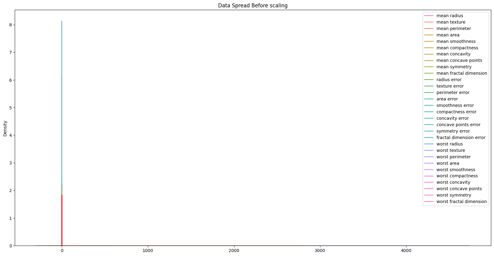

# Breast Cancer Prediction with Random Forest Classifier

This repository contains a Python implementation for predicting breast cancer diagnosis using the Random Forest Classifier. The dataset used is the breast cancer dataset from sklearn, which is a binary classification problem where the goal is to predict whether a tumor is malignant or benign based on various features.

### Project Overview
The project performs the following steps:
1. **Data Preprocessing**: Load the breast cancer dataset and standardize the features.
2. **Exploratory Data Analysis (EDA)**: Visualize the distribution of features and correlations.
3. **Feature Selection**: Use Random Forest to identify important features.
4. **Model Training**: Train a Random Forest Classifier.
5. **Model Evaluation**: Evaluate the model using accuracy, confusion matrix, and cross-validation scores.

### Prerequisites

Before running the code, ensure you have the following Python packages installed:
- `numpy`
- `pandas`
- `seaborn`
- `matplotlib`
- `scikit-learn`

You can install these packages using `pip`:

```bash
pip install numpy pandas seaborn matplotlib scikit-learn
```

### Steps to Run the Code

1. **Data Loading and Description**:
   The breast cancer dataset is loaded from `sklearn.datasets`. The dataset contains features that describe various properties of cell nuclei present in breast cancer biopsies.

   ```python
   data = load_breast_cancer()
   X = pd.DataFrame(data.data, columns=data.feature_names)
   y = pd.Series(data.target)
   ```

2. **Data Preprocessing**:
   - The features are standardized using `StandardScaler` to ensure that each feature contributes equally to the model.
   - The standardized data is visualized using seaborn's KDE plots.

   ```python
   scaler = StandardScaler()
   X_scaled = scaler.fit_transform(X)
   ```

3. **Exploratory Data Analysis (EDA)**:
   - The distribution of features is visualized using KDE plots.
   - A heatmap is created to visualize the correlation between features.

   ```python
   sns.kdeplot(X_scaled, color='blue')
   sns.heatmap(X.corr(), annot=True, cmap="coolwarm", fmt=".2f")
   ```
   
   
   
5. **Feature Selection**:
   - A Random Forest model is trained on the scaled data to determine the importance of each feature.
   - Features with importance above the mean value are selected for further model training.

   ```python
   rf = RandomForestClassifier(n_estimators=100, random_state=42)
   rf.fit(X_scaled, y)
   importances = rf.feature_importances_
   selector = SelectFromModel(rf, threshold="mean", max_features=10)
   X_selected = selector.fit_transform(X_scaled, y)
   selected_features = X.columns[selector.get_support()]
   ```

6. **Model Training**:
   - The data is split into training and testing sets (70% training, 30% testing).
   - A Random Forest Classifier is trained using the selected features.

   ```python
   X_train, X_test, y_train, y_test = train_test_split(X_selected, y, test_size=0.3, random_state=42)
   classifier = RandomForestClassifier(n_estimators=100, random_state=42)
   classifier.fit(X_train, y_train)
   ```

7. **Model Evaluation**:
   - The model is evaluated using accuracy and a confusion matrix.
   - Cross-validation is performed to check the generalizability of the model.

   ```python
   y_pred = classifier.predict(X_test)
   accuracy = accuracy_score(y_test, y_pred)
   cm = confusion_matrix(y_test, y_pred)
   cv_scores = cross_val_score(classifier, X_selected, y, cv=5)
   ```

### Outputs
- **Accuracy**: The accuracy of the Random Forest Classifier on the test set.
- **Confusion Matrix**: A confusion matrix that shows the true positives, false positives, true negatives, and false negatives for the predictions.
- **Cross-Validation Scores**: The cross-validation scores used to assess the stability of the model across different data splits.

### Visualizations
1. **Feature Distribution (KDE Plot)**: Shows the distribution of features and target values.
2. **Feature Correlation Heatmap**: Displays the correlation between features in the dataset.
3. **Confusion Matrix**: Visualizes the performance of the classifier in terms of true vs. predicted values.

### Example Output

```text
Selected Features: ['mean radius', 'mean texture', 'mean smoothness', 'mean compactness', 'mean concavity', 'mean concave points', 'mean symmetry', 'mean fractal dimension', 'radius error', 'texture error']
Accuracy: 97.37%
CV Scores: [0.98245614 0.97368421 0.97368421 0.97368421 0.98245614]
Mean CV Score: 0.98
```

### Conclusion
This project demonstrates how to use Random Forest to predict breast cancer diagnosis and evaluate the model's performance. Feature selection is performed using Random Forest's feature importance, which helps identify the most relevant features for prediction.

---
